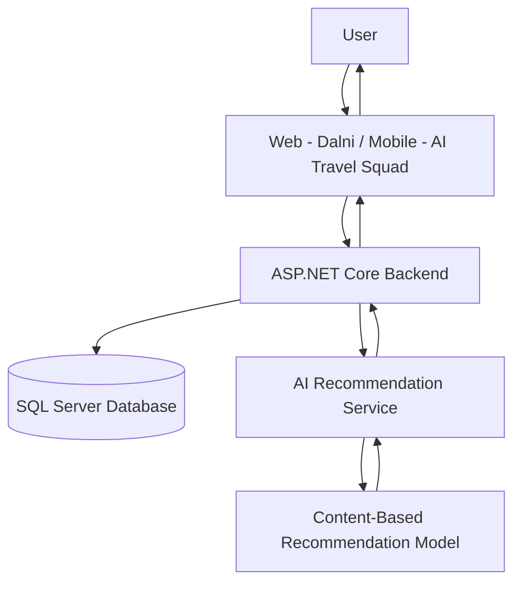
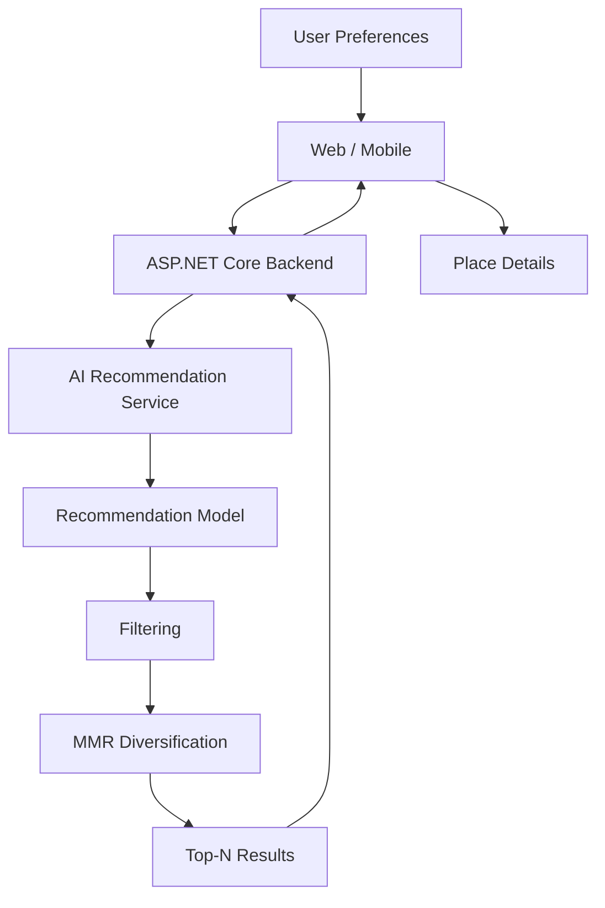

# Palestine Tourism Recommendation System

**Palestine Tourism Recommendation System** is a personalized travel-discovery platform for Palestine. Instead of showing every visitor the same generic list of attractions, it collects a traveler's preferences — cities, trip type, age group, budget, and group size — and returns a ranked, personalized set of places to visit.

The system combines a content-based AI/ML recommendation engine with a backend API and two client applications:

- **دلني (Dalni)** — the web experience
- **AI Travel Squad** — the mobile application (Flutter)

## The Problem

Generic "Top 10 places in Palestine" lists don't account for who is actually traveling. A young adventure traveler on a tight budget and a family looking for a relaxed cultural weekend need different recommendations even within the same region. Relevant recommendations depend on several factors that vary per traveler:

- City / cities of interest
- Age group
- Trip type
- Budget
- Group size

## The Solution

The system:

1. Collects user preferences through the web or mobile interface.
2. Sends them to the backend API.
3. The backend forwards the request to the AI recommendation service.
4. The AI service builds a user profile, scores places by similarity, and applies budget/city/type filtering.
5. MMR (Maximal Marginal Relevance) re-ranks the results to improve diversity.
6. The backend returns the final list to the client, which displays recommendations with details, maps, comparison, favorites, and sharing.

## System Architecture



| Layer | Responsibility |
|---|---|
| **Frontend (Dalni)** | Web interface for entering preferences and viewing/exploring recommendations. |
| **Mobile (AI Travel Squad)** | Flutter app offering the same journey — preferences, results, place details, favorites — on mobile. |
| **Backend** | ASP.NET Core API handling business logic, the tourist-places database, and integration with the AI recommendation service. |
| **AI/ML** | Recommendation service/model responsible for preparing user input and generating personalized, ranked recommendations. |

> **Note on verification:** The AI/ML component was directly inspected from its notebook. The Backend, Frontend, and Mobile sections below are documented from each component's own project documentation, as source code for those components was not available for direct inspection.

## Project Structure

```
Project/
├── AI&ML/            # Recommendation model notebook, dataset, and exported artifacts
├── Backend/           # ASP.NET Core Web API (AiTravelSquad.Api)
├── Frontend/           # Dalni web interface (static HTML/JS)
├── Mobile/             # AI Travel Squad Flutter application
└── README.md
```

---

# AI/ML Recommendation System

A content-based recommendation model that ranks tourist places against a user's stated preferences.

```
User Input
   → Input Translation
   → User Profile
   → One-Hot Encoding
   → Cosine Similarity
   → Recommendation Score
   → Filtering
   → MMR (Maximal Marginal Relevance)
   → Top-N Recommendations
```

- **One-Hot Encoding** — `OneHotEncoder` converts categorical attributes (`type`, `City`, `Budget_Level`, `Age_Group`, `Trip_Type`) into binary features for numerical comparison.
- **Cosine Similarity** — measures how closely the user's preference vector aligns with each place's feature vector.
- **Recommendation Score** — combines cosine similarity with direct match signals (city, trip type, age) and a budget-fit component into one weighted score.
- **Budget Fit** — compares a place's estimated cost, scaled by group size, against the user's total budget.
- **Filtering** — narrows candidates by selected cities, trip types, age compatibility, and total cost within budget.
- **MMR** — applied after scoring and filtering, and before the final Top-N list, to reduce repetitive results and improve diversity. MMR is a re-ranking technique, not a machine-learning model.

## Dataset

| | |
|---|---|
| File | `palestine_tourist_attractions_v2.csv` |
| Size (after cleaning) | 308 places × 17 columns |
| Model features | `type`, `City`, `Budget_Level`, `Age_Group`, `Trip_Type` |

**Columns:** `ID`, `Place_Name`, `type`, `City`, `Budget_Level`, `Age_Group`, `Trip_Type`, `Description`, `Latitude`, `Longitude`, `Coordinate_Source`, `Geocode_Status`, `Estimated_Cost_ILS`, `Place_Name_AR`, `Description_AR`, `Description_EN`, `Image_URL`

## AI Artifacts

| Artifact | Purpose |
|---|---|
| `palestine_tourism_recommendation.ipynb` | Main notebook: data loading, feature engineering, model building, and testing |
| `encoder.pkl` | Fitted `OneHotEncoder` used to transform new user input |
| `feature_matrix.pkl` | Pre-computed one-hot feature matrix for all places |
| `tourism_data.pkl` | Exported tourism dataset for backend use |

The AI/ML notebook produces the recommendation logic and artifacts consumed by the AI recommendation service that the backend integrates with (see [Backend](#backend) and [Deployment](#deployment)).

---

# Backend

ASP.NET Core Web API (`AiTravelSquad.Api`) that acts as the integration layer between the client applications, the tourist-places database, and the AI recommendation service.

**Architecture:** Clean architecture with separated Domain, Infrastructure, and API projects.

**Confirmed capabilities:**

- SQL Server database integration via Entity Framework Core
- ASP.NET Core Identity (authentication/authorization middleware)
- Tourist place data management, including CSV dataset import
- Arabic and English place information and images
- Multi-city and multi-trip-type selection, age group, numeric budget, and group size
- Integration with the external AI recommendation service, with recommendation ranking based on AI similarity scores
- Recommendation history storage
- Place lookup by ID
- CORS configuration
- Standardized API error responses
- Swagger/OpenAPI for development testing

## API Endpoints

### `POST /api/Recommendations`

Request body:

```json
{
  "Cities": ["Nablus"],
  "TripTypes": ["Cultural"],
  "AgeGroup": "Family",
  "Budget": 500,
  "GroupSize": 4
}
```

`AgeGroup` is one of `All`, `Family`, `Youth`, translated internally before being sent to the AI service. `Budget` is the total budget for the group in ILS.

Each returned recommendation includes: `placeId`, `placeName`, `placeType`, `city`, `description`, `matchScore`, `rankOrder`, `imageUrl` (optional).

### `GET /api/Places/{id}`

Returns: `placeName`, `placeNameAr`, `descriptionAr`, `city`, `placeType`, `latitude`, `longitude`, `estimatedCostIls`, `budgetLevel`, `tripType`, `ageGroup`, `imageUrl`.

### Error Responses

```json
{
  "status": 400,
  "message": "Invalid request data.",
  "errors": { "$.Cities": ["The JSON value could not be converted..."] }
}
```

| Status | Meaning |
|---|---|
| 400 | Invalid request data (model validation) |
| 404 | No places match the given preferences and budget |
| 502 | The AI recommendation service is currently unavailable |

### CORS

Allows common local development origins on ports `5500`, `5501`, `3000`, `8080`, with `GET`, `POST`, `PUT`, `DELETE` methods enabled.

### Swagger

Available in the development environment for testing endpoints such as `POST /api/Recommendations` and `GET /api/Places/{id}`.

## Running the Backend

```bash
dotnet restore
dotnet build
dotnet run
```

Requires a valid SQL Server connection string in `AiTravelSquad.Api/appsettings.json`, and the AI service base URL configured as:

```json
"AiApi": {
  "BaseUrl": "https://palestine-tourism-recommendation-api.onrender.com"
}
```

By default the API runs at `http://localhost:5286`, with Swagger at `http://localhost:5286/swagger`.

---

# Web Frontend

**دلني (Dalni)** is the web interface for the platform. Users select cities, trip type, age group, group size, and budget, and see the most relevant places ranked by match score, with a map, comparison, favorites, and sharing.

## Technologies

No build step — static HTML pages loading libraries from CDN:

| Library | Use |
|---|---|
| Tailwind CSS (CDN) | Styling |
| Lucide | Icons |
| Leaflet + OpenStreetMap | Maps |
| qrcodejs | QR codes for sharing |
| Cairo, Noto Kufi Arabic, IBM Plex Sans Arabic | Arabic fonts |

Plain JavaScript (no framework), inline per page, plus a shared `assets/layout.js`.

## Pages and User Flow

```
index.html → preferences.html → results.html → place.html
                     ↑                |
                     └── edit preferences
```

| Page | Purpose |
|---|---|
| `index.html` | Home page: hero section, "how it works," featured destinations, call to action |
| `preferences.html` | 5-step preference form (cities, trip type, age group, group size, budget) with a live trip summary |
| `results.html` | Sends the recommendation request, fetches place details, and renders ranked results with filters, sorting, map, comparison, and a "saved" tab |
| `place.html` | Place details: description, info table, match reason, mini-map, and a cost calculator |

## Key Features

Ranked results with match percentage, filters (place type, "within my budget," "free entry"), sort by relevance or lowest cost, interactive map (distinguishing precise vs. approximate location), side-by-side comparison of two places, favorites (stored locally), trip sharing via link and QR code, and a fully Arabic (RTL), mobile-responsive UI.

## Local Setup

**Requirements**

- Backend running at `http://localhost:5286` (`dotnet run --launch-profile http` from `Backend/AiTravelSquad.Api`)
- A local static file server (e.g. VS Code's Live Server extension)
- Internet connection (for CDN libraries, fonts, and map tiles)

**Steps**

1. Start the backend and confirm `http://localhost:5286/swagger` loads.
2. Open the `Frontend` folder in VS Code and run `index.html` with Live Server (default port 5500).
3. Do not open the files directly via `file://` — the backend's CORS policy only allows specific localhost ports (e.g. 5500, 5501, 3000).

---

# Mobile Application

**AI Travel Squad** is the mobile application, built with **Flutter** and **Dart**, that helps users discover tourist places in Palestine matched to their trip preferences.

## User Flow

```
Splash Screen → Home Screen → Preferences Screen → Results Screen → Place Details → Favorites / Explore
```

| Screen | Purpose |
|---|---|
| Splash Screen | App intro, then auto-navigates to Home |
| Home Screen | App introduction and "Start Journey" entry point |
| Preferences Screen | Collects city, budget level, group size, trip type, and age group; validates required fields |
| Results Screen | Shows preferences summary and the list of matching places with a match percentage |
| Place Details | Full details for a selected place, favorite toggle, map link, and similar-place suggestions |
| Favorites Screen | Saved places for quick access later |
| Download Screen | "Download Travel Guide" with a progress indicator |

## Recommendation Matching

In the current version, matching is based primarily on **city and trip type overlap** between the user's preferences and the app's place data — a rule-based comparison rather than a call to a live AI model. Documentation for this component notes it can be developed further to use a real AI model in the future.

## Project Structure

```
lib/
├── main.dart
├── data/
│   └── place_data.dart
├── models/
│   └── place_model.dart
└── screens/
    ├── splash_screen.dart
    ├── home_screen.dart
    ├── preferences_screen.dart
    ├── result_screen.dart
    ├── place_details.dart
    ├── favorites_screen.dart
    └── download_screen.dart
```

`PlaceModel` fields: `name`, `city`, `type`, `description`, `image`, `score`.

## Technologies

Flutter, Dart, and Material Design widgets (`Scaffold`, `AppBar`, `Card`, `DropdownButtonFormField`, `TextFormField`, `ElevatedButton`, `LinearProgressIndicator`, `ListView`).

---

# End-to-End Data Flow



# User Flow

1. User opens the web app or mobile app.
2. Selects preferred city/cities.
3. Selects age group.
4. Selects trip type.
5. Enters group size.
6. Enters total budget.
7. Submits preferences.
8. Backend sends the request to the recommendation service.
9. The AI/ML pipeline generates ranked recommendations.
10. Results are returned to the client.
11. User explores place details.
12. User can save favorites, view the map, compare places, or share results (web).

---

# Technologies

| Layer | Technologies |
|---|---|
| AI/ML | Python, pandas, NumPy, scikit-learn, joblib, Jupyter/Colab |
| Backend | ASP.NET Core, Entity Framework Core, ASP.NET Core Identity, SQL Server |
| Frontend | HTML, JavaScript, Tailwind CSS, Leaflet, OpenStreetMap, Lucide, qrcodejs |
| Mobile | Flutter, Dart |

---

# Installation & Setup

### AI/ML Setup

Run the notebook in Jupyter or Google Colab with: `pandas`, `numpy`, `scikit-learn`, `matplotlib`, `seaborn`, `joblib`.

### Backend Setup

```bash
dotnet restore
dotnet build
```

Configure a SQL Server connection string and the `AiApi:BaseUrl` value in `AiTravelSquad.Api/appsettings.json`.

### Frontend Setup

No build step required. Serve the `Frontend` folder with a local static server (e.g. Live Server) rather than opening files directly.

### Mobile Setup

Standard Flutter project setup (`flutter pub get` followed by `flutter run` from the project root, with a configured Flutter/Dart toolchain).

---

# Running the Complete System

Recommended local startup order:

1. **Database** — SQL Server instance reachable by the connection string in `appsettings.json`.
2. **AI Recommendation Service** — the deployed AI service (or a local equivalent) that the backend's `AiApi:BaseUrl` points to.
3. **Backend** — `dotnet run` (default: `http://localhost:5286`, Swagger at `/swagger`).
4. **Frontend** — served locally via Live Server (default port `5500`).
5. **Mobile** — run via `flutter run`.

# Deployment

The AI recommendation service is deployed and referenced by the backend via:

```
https://palestine-tourism-recommendation-api.onrender.com
```

Deployment details for the Backend, Frontend, and Mobile components were not confirmed in the available project documentation.

# Limitations

- The dataset covers 308 verified places, which may not represent every attraction across all Palestinian cities.
- As a content-based system, the AI/ML pipeline relies on categorical dataset attributes and has no user history or ratings to learn from.
- Most database places use a fallback city-center coordinate rather than a precise location; only points within 15 km of that center are treated as precise on the map.
- The AI service (hosted on Render) may respond slowly or fail on the first request after a period of inactivity; the frontend allows up to 90 seconds for a response.
- The mobile app's current matching logic compares city and trip type only, and does not yet call the AI recommendation service used by the web/backend.
- No automated tests are documented for the frontend at this time.

# Future Improvements

> Proposed directions, not implemented functionality.

- Semantic/TF-IDF similarity on place descriptions.
- User ratings and collaborative or hybrid recommendation approaches.
- A larger, more geographically verified dataset (including more precise coordinates).
- Live weather information and GPS-based suggestions (mobile).
- Persistent (account-based) favorites and a booking system (mobile).
- A shared configuration source for cities/trip types/age groups across frontend pages, to remove current duplication.

# Team

AI Travel Squad
